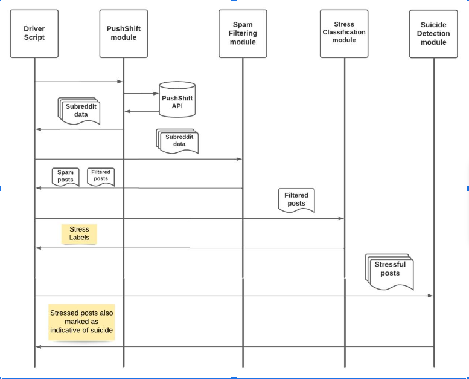

# Analyzing Stressful Text Based On Social Media Posts

Incorporated dynamic, real-time data using a RESTful API, Pushshift and implemented spam filtering using POS tagging. The model used the NLTK library to perform Natural Language Processing based techniques-tokenization, lemmatization for data preprocessing, and TF-IDF Vectorization for Feature Engineering. Built a classifier using Naive Bayes, SVM, and Decision tree algorithms and evaluated it using F-1 score.

